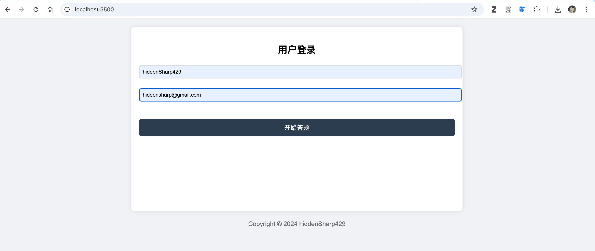
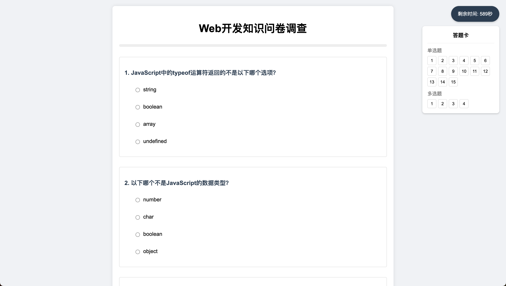
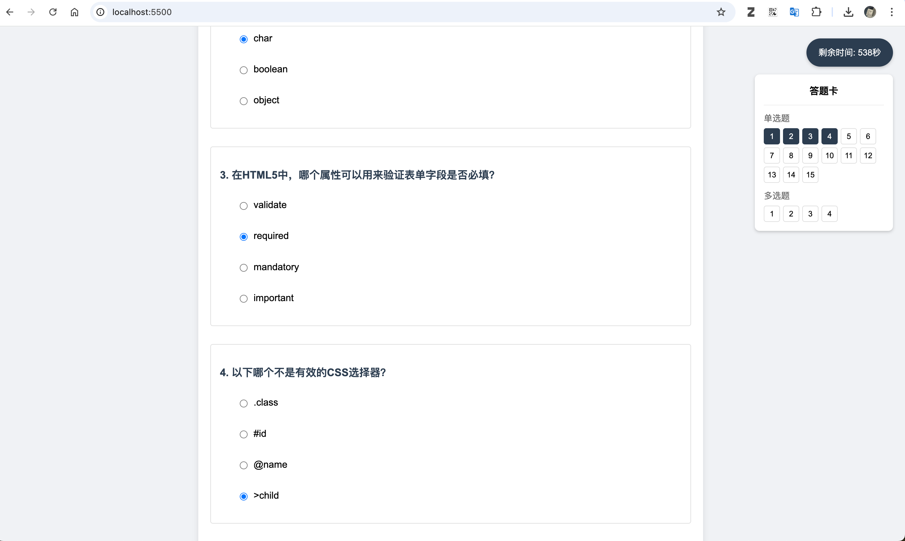
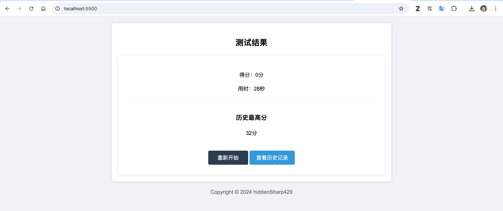
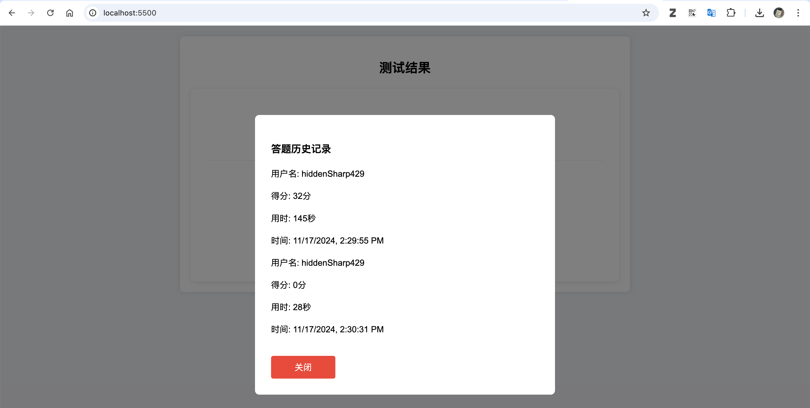

<!--
 * @Author: hiddenSharp429 z404878860@163.com
 * @Date: 2024-11-17 14:32:02
 * @LastEditors: hiddenSharp429 z404878860@163.com
 * @LastEditTime: 2024-11-17 14:38:34
-->
# Answer Sheet Demo
This is a demo of an answer sheet for a quiz. It's a simple web app that allows you to take a quiz and submit your answers.

> It also is a course assignment for the course "Web Development" 

## Features
- [x] Single choice questions
- [x] Multiple choice questions
- [x] Timer
- [x] History record
- [x] Responsive design
- [x] Judge the answer
- [x] Use local storage to store the data
- [x] Apply regular expressions to validate the email address

## How to use
1. Clone the repository
2. Open the `index.html` file in the browser Or use the live server to open it
3. Enjoy it!

## Screenshot

